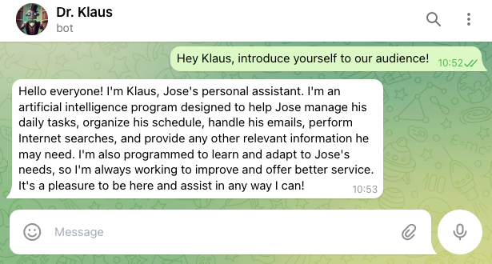

# Nimmo

> _"If you guard your mind carefully and keep it blank of any clutter of information till maturity is reached, filling it only with intelligence and training it only in clear thinking, you then have a powerful instrument at your disposal"_

This project is the continuation of [Luna](https://github.com/JoseHervas/luna), my first personal assistant chatbot.

The emergence of ChatGPT changed the rules of AI assistants, so I decided to start a completely new virtual assistant from scratch using ChatGPT.

### Features

- Nimmo is a modular personal assistant. He's designed to be flexible and extensible. Adding features is as simple as adding new scripts to the `modules` folder.

- Right now, he comes with the following capabilities:

  - He can talk by **Telegram**. There's a security restriction that prevents him from talking to strangers. You can change the env var `TELEGRAM_CHATID` to get him to talk only to you.

  - His brain is OpenAI's ChatGPT, so we can say Nimmo inherits all the features of this AI model (he speaks 95 natural languages, he knows how to code, he can give really useful insights about a lot of topics, etc...)

  - He can check the weather forecasts in your area. He ingests a really big amount of raw data (humidity, UV levels, wind, etc...) and makes a friendly summary for you.

  - He can check and summarize the latest news. In just a few seconds he will read several 100s of newspapers and he will make a short summary of them in just a few lines. You can then talk with him about those news.

  - He can also read the latest scientific papers published on **Nature\*** and he creates a friendly summary of the new findings. This helps me to stay up to date with the state of the art on the scientific community.

 

\* _I'm currently working on extending this capability to enable Nimmo to read and summarize scientific papers on many more journals._

## How to use

- Clone/download the repo and install the dependencies (`pip install requisites.txt`)
- Talk to the [Bot Father](https://telegram.me/BotFather) on Telegram and ask him to give you a Telegram API key.
- Register yourself on the [OpenAI's platform](https://platform.openai.com/) to get an API key.
- Create the env variables (`cp .env.template .env`) and edit them with your values.
- Run `python src/main.py`

## License

Of course! MIT License <3

have fun!
