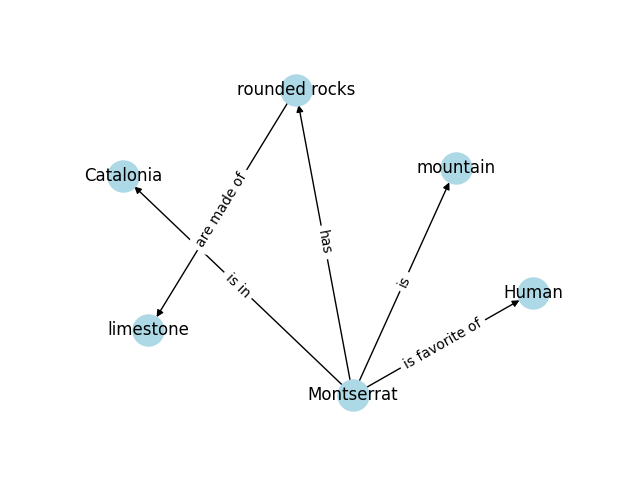

## Memory

We have two primary types of knowledge for Large Language Model (LLMs). The parametric knowledge refers to everything the LLM learned during training and acts as a frozen snapshot of the world for the LLM.

The second type of knowledge is source knowledge. This knowledge covers any information fed into the LLM via the input prompt.

The Conversational Memory is a sub-type of source knowledge, and it allows a LLM to remember previous interactions with the user.

When working with Conversational Memory, you have to deal with a tug of war between accuracy and token usage. The main limiter is the scope window of the LLM.

If a model like GPT, for example, has a scope window of approx. 4K tokens, that means your chatbot will have a limited working memory. If you store the raw iterations between the User and the IA, your chatbot will barely be able to remember the last few iterations. If you store only a summary of the iterations between the User and the IA, the window of iterations your chatbot will remember is wider, but you loose accuracy.

LangChain has [many multiple Conversational Memory systems](https://www.pinecone.io/learn/langchain-conversational-memory/#forms-of-conversational-memory) that balance token usage vs accuracy.

Nimmo has a combination of `ConversationSummaryBufferMemory` and `ConversationKnowledgeGraphMemory` to store internally the past conversations between the User and the IA.

#### `ConversationSummaryBufferMemory`

Stores the last 650 tokens of the conversation in raw. All the older parts of the conversation are summarized with the same LLM and stored as well. This means that the most recent parts of the conversation have the highest accuracy while the older parts of the conversation are more blurry on Nimmo's memory (similarly to how human's memory work)

#### `ConversationKnowledgeGraphMemory`

Creates a graph based on knowledge triplets. It allows Nimmo to remember specific entities and the relationship between them. For example:

